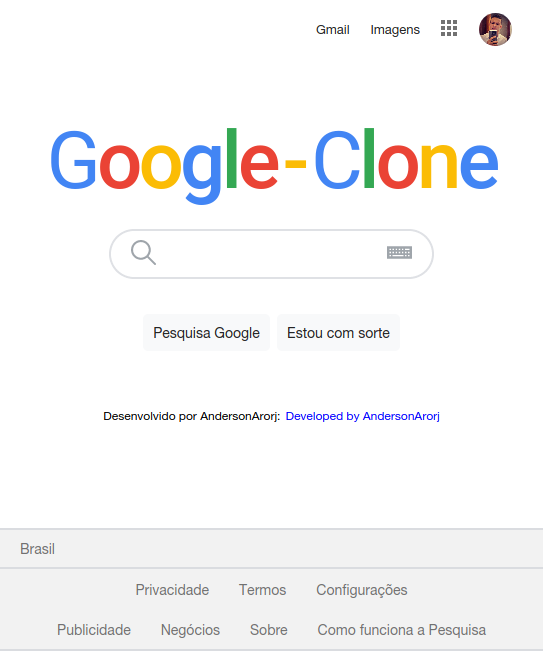
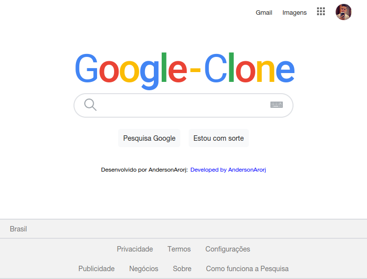
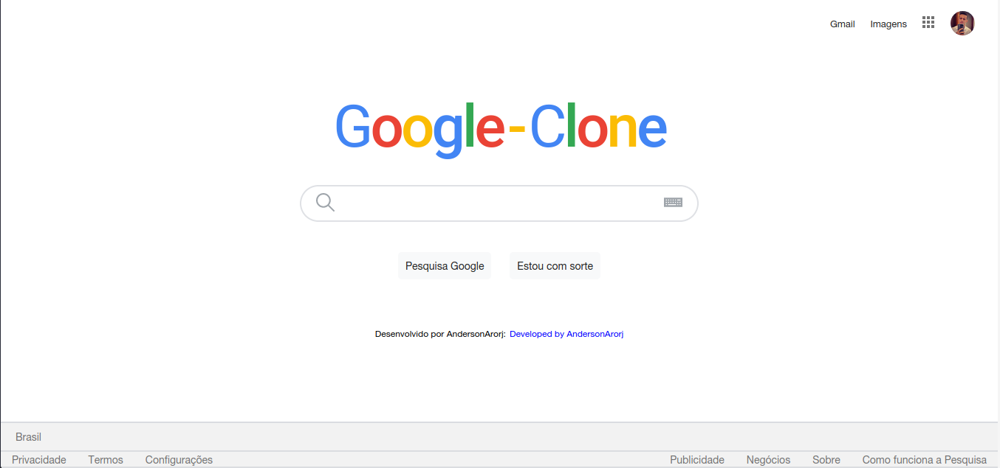

<h1 align="center">Welcome to Gooogle-Search-Clone 👋</h1>
<p>
  
  <a href="LICENSE" target="_blank">
    
  </a>
  <a href="https://twitter.com/andersonarorjdev" target="_blank">
    
  </a>
</p>


<h4>I know that you use with a lot of times every day,🌝 but you can create it?🤔</h4>

> I already tried to clone much interfaces,😎 somes i can and somes dont was good 😢. But, i think everyone, one time on life already did a search in the famous Google.
> 
>> So...why don't try to do it?🤔🚀

***


 <h1 align="center">Small Breakpoint</h1>

 ***
<p align="center">
  
</p>

 <h1 align="center">Medium Breakpoint</h1>

 ***
<p align="center">
  
</p>

  <h1 align="center">Expanded Breakpoint</h1>

 ***
<p align="center">
  
</p>

## Downloading project
```sh
  git clone https://github.com/andersonarorjdev/Google-Search-Page.git
```


## Install the Dependencies

```sh
yarn install
```

## Starting the server to see the project

```sh
yarn run 
``` 

## Author

👤 **Andersonarorjdev**

* Website: https://andersonarorjdev.github.io
* Twitter: [@andersonarorjdev](https://twitter.com/andersonarorjdev)
* Github: [@andersonarorjdev](https://github.com/andersonarorjdev)
* LinkedIn: [@andersonarorjdev](https://linkedin.com/in/andersonarorjdev)

## Show your support

Give a ⭐️ if this project helped you!

## 📝 License

Copyright © 2020 [Andersonarorjdev](https://github.com/andersonarorjdev).<br />
This project is [MIT](LICENSE) licensed.

***
_This README was generated with ❤️ by [readme-md-generator](https://github.com/kefranabg/readme-md-generator)_